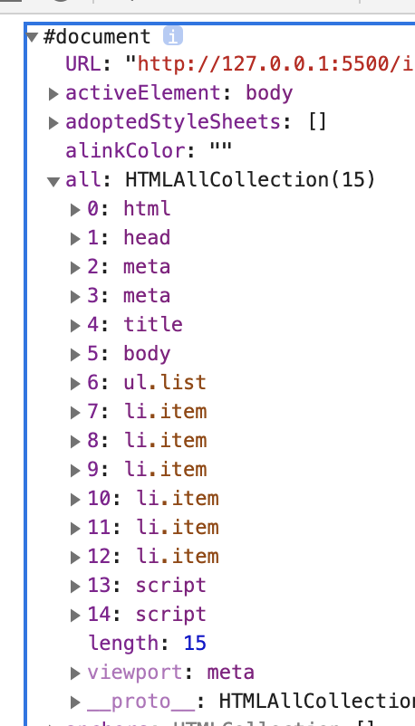

# Learn-jacascript

## basics

- [for of, forEach](https://github.com/since-1994/Learn-jacascript/commit/490acb1408edca0134b7db8c1dc27eeb841559f2)
- [for in]()
- [scope]()

## DOM

- [what is DOM](#)



- [getElementsBy & getElementBy]()
- [querySelector & querySelectorAll](https://github.com/since-1994/Learn-jacascript/commit/9c1cc73824a471931dbc59fdd44618ce4b58a827)
- [querySelectorAll 과 getElementsBy의 차이점]()

  - querySelectorAll을 하면 NodeList를 얻고 getElementsBy를 하면 HTMLCollection을 얻는다.
  - NodeList는 중간에 item이 추가 되더라도 자동 업데이트를 하지 않는다.
  - HTMLCollection은 중간에 item이 추가되면 자동으로 업데이트를 한다.

    **그렇다면 querySelector를 지양해야 하는가? 그렇지 않다. item들을 포함하는 부모를 찾고 부모의 children을 부르면 알아서 HTMLCollection을 불러주기 때문이다.**

- [Events](./events.js)

  - 일반적으로 addEventListener(EVENTNAME, 콜백함수)가 일반적인 구조이다.
  - 콜백함수는 argument로 event를 사용할 수 있고, event는 event에 대한 정보를 담고 있다.(클릭 좌표, 키보드 키)
  - css와 사용하면 좋다. `h1.classList.toggle()`은 클래스명이 있으면 제거하고 없으면 추가한다.

- [Event Bubbling]()
  Bubbling이라는 이름은 기포가 뽀글뽀글 올라가는거라고 생각하면 된다. 아래 코드를 보자.

```html
<ul>
  <li></li>
  <li></li>
  <li></li>
</ul>
```

```javascript
li.addEventListener("click", function1);
ul.addEventeListener("click", function2);
```

위의 상황에서 li를 클릭하면 어떻게 될까? function1과 function2가 모두 실행된다. 이것이 bubbling이다. body, html, window.. 계속 올라가게 된다. 만약 bubbling을 막고 싶다면 `event.stopPropagation()`을 해주어야 한다.

event를 통해 click event가 이루어진 자식을 구분할 수 있다. 아래와 같이 사용 가능하다.

```javascript
div.addEventListener("click", function (event) {
  console.log(event.target);
});
```

- [Session & local storage]()

  - local-storage 사용법

    - LocalStorage.setItem('key', value);
    - LocalStorage.getItem('key', value);
      value에는 string만 저장할 수 있기 때문에 array나 object를 그대로 저장하면 다시 사용할 수가 없다.

    ```javascript
    const numbers = [1, 2, 3];
    LocalStorae.setItem("numbers", JSON.stringify(numbers));
    const retrieved = JSON.parse(LocalStorage.getItem("numbers"));
    ```

    위와 같이 사용해야 한다.

    - LocalStorage.clear(); //localstorage를 모두 지운다.

  - session-storage 사용법

    - sessionStorage.setItem('key', value);

  - 두 storage의 차이점
    localStorage는 브라우저를 재시동해도 날아가지 않는다. sessionStorage는 날아간다.
