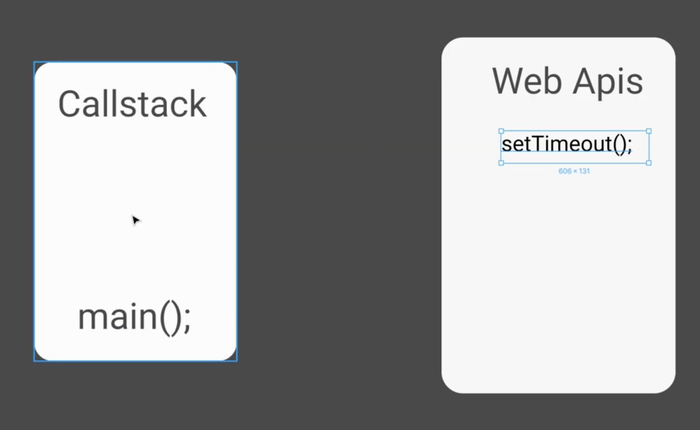

# Learn-jacascript

## Array basics

- [for of, forEach](https://github.com/since-1994/Learn-jacascript/commit/490acb1408edca0134b7db8c1dc27eeb841559f2)
- [for in](https://github.com/since-1994/Learn-jacascript/commit/9c7d7d4eabeaf9422546ab888ff419d89d505375)
- join

  seperator를 인자로 받습니다. seperator를 배열 원소 사이에 넣어 문자열로 합쳐줍니다.

```javascript
const arr = ["h", "e", "l", "l", "o"];
// Seperator를 정해주지 않으면 default값은 ,입니다.
console.log(arr.join()); // 'h,e,l,l,o'
// Seperator를 ''공백 없는 string으로 주면
console.log(arr.join("")); // 'hello'
```

- split

  split은 seperator와 limit을 인자로 받습니다. seperator는 string이나 정규식 표현을 줄 수 있고 limit은 number를 받습니다. limit은 optional입니다.

```javascript
const string = "h, e, l, l, o";
const arr = string.split(", ", 4);
console.log(arr); //['h', 'e', 'l', 'l']
```

- reverse

```javascript
const arr = [1, 2, 3, 4, 5];
arr.reverse();
console.log(arr); // [5, 4, 3, 2, 1]
```

- splice

  splice는 start와 end를 인자로 받고 start <= 범위 < end를 배열로부터 잘라 return 합니다.

```javascript
const arr = [1, 2, 3, 4, 5];
const result = arr.splice(0, 2);
console.log(result); // [1, 2]
console.log(arr); // [3, 4, 5]
```

- slice

  slice도 start와 end를 인자로 받는데요. splice와 동일하지만 원래 배열에는 영향을 미치고 싶지 않을 때 사용합니다.

```javascript
const arr = [1, 2, 3, 4, 5];
const result = arr.slice(0, 2);
console.log(result); // [1, 2]
console.log(arr); // [1, 2, 3, 4, 5]
```

- find, filter, map, some, every, reduce

```javascript
class Student {
  constructor(name, score, enrolled) {
    this.name = name;
    this.score = score;
    this.enrolled = enrolled;
  }
}

const students = [
  new Student("minseok", 100, true),
  new Student("hee", 100, false),
  new Student("gu", 50, true),
];

const studnet1 = students.find((student) => student.score === 100);

const enrolledStudents = students.filter((student) => student.enrolled);

const scores = students.map((student) => student.score);

// 조건을 하나라도 만족하면 true 그렇지 않으면 false를 return
const minseok = students.some((student) => student.name === "minseok");

const minseok2 = students.every((student) => student.name === "minseok");

/*
 reduce는 배열의 어떤 값을 누적할 때 사용한다.

 reduce는 콜백 함수와 initial value를 인자로 받으며 콜백 함수의 인자는 prev와 cur이 들어간다. prev는 직전 호출 함수의 return 값이 되고 cur은 현재 element를 의미한다. 

 initial value를 정의하지 않으면 배열의 0번째 index element가 initial value가 된다.
*/
const sum = students.reduce((prev, cur) => {
  return prev + cur.score;
}, 0);
```

## DOM

- [what is DOM](#)


- [getElementsBy & getElementBy]()
- [querySelector & querySelectorAll](https://github.com/since-1994/Learn-jacascript/commit/9c1cc73824a471931dbc59fdd44618ce4b58a827)
- [querySelectorAll 과 getElementsBy의 차이점]()

  - querySelectorAll을 하면 NodeList를 얻고 getElementsBy를 하면 HTMLCollection을 얻는다.
  - NodeList는 중간에 item이 추가 되더라도 자동 업데이트를 하지 않는다.
  - HTMLCollection은 중간에 item이 추가되면 자동으로 업데이트를 한다.

    **그렇다면 querySelector를 지양해야 하는가? 그렇지 않다. item들을 포함하는 부모를 찾고 부모의 children을 부르면 알아서 HTMLCollection을 불러주기 때문이다.**

- [NodeList]()
  어떤 element의 element.childNodes를 하면 childNodes는 text까지 불러오기 때문에 조심해야 한다. 아래 예시를 보자

```html
<div class="parent"></div>
```

```javascript
const parent = document.querySelector(".parent");
const children = parent.childNodes; //NodeList를 반환
```

위와 같았다면 childNodes는 공백도 가져오기 때문에 주의를 해야 한다.

- [Event 종류]()

  - transitionend
    언제 쓰면 좋냐면 특정 에니매이션이 실행된 뒤에 실제 코드가 돌아가길 원할때 유용하게 사용할 수 있다.예시는 아래와 같다.

  ```javascript
  target.classList.add("fall");
  target.addEventListener("transitionend", function () {
    target.remove();
  });
  ```

  위의 코드는 떨어지는 애니메이션 뒤에 실제 삭제가 되도록 하는 코드이다.

  - DOMContentLoaded
    이 이벤트는 HTML 문서를 완전히 불러오고 분석했을 떄 실행됩니다. localStorage에서 뭐 불러오는 트리거로 사용하기 좋습니다. 아래와 같이 사용할 수 있습니다.

  ```javascript
  document.addEventListener("DOMContentLoaded", load);
  ```

- [Events](./events.js)

  - 일반적으로 addEventListener(EVENTNAME, 콜백함수)가 일반적인 구조이다.
  - 콜백함수는 argument로 event를 사용할 수 있고, event는 event에 대한 정보를 담고 있다.(클릭 좌표, 키보드 키)
  - css와 사용하면 좋다. `h1.classList.toggle()`은 클래스명이 있으면 제거하고 없으면 추가한다.

- [Event Bubbling]()
  Bubbling이라는 이름은 기포가 뽀글뽀글 올라가는거라고 생각하면 된다. 아래 코드를 보자.

```html
<ul>
  <li></li>
  <li></li>
  <li></li>
</ul>
```

```javascript
li.addEventListener("click", function1);
ul.addEventeListener("click", function2);
```

위의 상황에서 li를 클릭하면 어떻게 될까? function1과 function2가 모두 실행된다. 이것이 bubbling이다. body, html, window.. 계속 올라가게 된다. 만약 bubbling을 막고 싶다면 `event.stopPropagation()`을 해주어야 한다.

event를 통해 click event가 이루어진 자식을 구분할 수 있다. 아래와 같이 사용 가능하다.

```javascript
div.addEventListener("click", function (event) {
  console.log(event.target);
});
```

- [Session & local storage]()

  - local-storage 사용법

    - LocalStorage.setItem('key', value);
    - LocalStorage.getItem('key', value);
      value에는 string만 저장할 수 있기 때문에 array나 object를 그대로 저장하면 다시 사용할 수가 없다.

    ```javascript
    const numbers = [1, 2, 3];
    LocalStorae.setItem("numbers", JSON.stringify(numbers));
    const retrieved = JSON.parse(LocalStorage.getItem("numbers"));
    ```

    위와 같이 사용해야 한다.

    - LocalStorage.clear(); //localstorage를 모두 지운다.

  - session-storage 사용법

    - sessionStorage.setItem('key', value);

  - 두 storage의 차이점
    localStorage는 브라우저를 재시동해도 날아가지 않는다. sessionStorage는 날아간다.

## ARRAY

- HIGHER FUNCTION
  Higher function이란 다른 함수(메서드)를 parameter로 받는 것을 의미한다.

```javascript
function repeater(fn) {
  fn();
  fn();
  fn();
}
```

- CALLBACK METHOD
  Higher function에 인자로 들어가는 함수를 callback 함수라고 한다. 그니까 바로 실행되는게 아니고 특정한 호출에 의해서 실행되는 함수를 callback 함수라고 생각하면 된다.

- MAP
  MAP은 reference type을 복사하는데 사용된다. 아래 예시를 보자.

```javascript
const videos = [1, 2, 3, 4];
cosnt newVideos = videos.map(function(video){
  return video+1;
});

console.log(newVideos);//[2, 3, 4, 5]
```

만약에 return을 해주지 않더라도 map은 항상 return을 해주기 때문에 [undefined, undefined, undefined]이런식으로 된다. 이것은 완전복사라서 원래 배열에 영향을 미치지 않는다.

- FIND
  find 메서드는 조건에 맞는 첫번째 소자를 return 해준다.

```javascript
const videos = ["hello", "hi", "fancy video"];

const searchResult = videos.find(function (video) {
  return video.includes("fancy");
});

console.log(searchResult); //fancy video
```

- FILTER
  filter는 find와 비슷한 역할을 하지만 multiple value를 반환해줍니다.

```javascript
const videos = [1, 2, 3, 4];

const result = videos.filter(function (video) {
  return video < 3;
});

console.lod(result); // [1, 2];
```

- SOME and EVERY
  먼저 some과 every는 bool 을 반환하는 메서드다. 아래 예시를 보자.

```javascript
const numbers = [1, 2, 3, 4];

const bigger = numbers.every(function (number) {
  return number > 2;
});

console.log(bigger); //false
```

어떤 조건에 대해 어떤 value만 만족하는지 확인하려면 `some`을 사용하고 모든 value가 만족하는지 확인하려면 `every`를 사용하자.

- ARROW FUNCTION

```javascript
const games = ["minecraft", "pockemon"];

const arraowGame = games.map((game) => game + "2");

console.log(arrowGame); // ["minecraft2", "pockemon2"]
```

위에 예시처럼 arrow function에서 만약 return 값만 필요하다면 `return`을 생략하고 적을 수도 있다.

- SORT

javascript sort는 특이한게 number를 string으로 바꿔서 정렬을 한다. 아래를 보자.

```javascript
const numbers = [2, 3, 4, 1];

numbers.sort();

console.log(numbers); // [1, 2, 3, 4]

const weird = [22, 1, 3];

weird.sort();

console.log(weird); // [1, 22 ,3]
```

그래서 숫자를 정렬하려면 compare function 이 필요하다. 아래를 보자

```javascript
const weird = [22, 1, 3];

weird.sort(function (a, b) {
  return a - b; //오름 차순 compare function 내림 차순 : b-a;
});

console.log(weird); // [1, 3, 22]
```

compare function을 이용하면 object 들도 특정 property를 기준으로 정렬할 수 있다.

- COPY with ...(SPREAD)

spread를 이용하면 배열을 간단하게 복사할 수 있습니다.

```javascript
const ratings = [1, 2, 3, 4];

const copied = [...ratings];

copied[0] = 0;

console.log(ratings); ///[1, 2, 3, 4]

/////////////////////////////////////////////////////////////////

const name = "minseok;

const name_array = [...name];

console.log(name_array); // ['m', 'i', 'n', 's', 'e', 'o', 'k']
```

위와 같이 간단하게 복사할 수도 있고 문자열을 간단히 배열로 만들수도 있습니다. 또한 여러 배열을 합치는데도 사용할 수 있습니다.

```javascript
const numbers = [1, 2];
const otherNumbers = [3, 4];

const allNumbers = [...numbers, ...otherNumbers, 5, 6];

console.log(allNumbers); // [1, 2, 3, 4, 5, 6]
```

## OBJECT

- GLOBAL EXECUTION CONTEXT

빈 파일을 실행시키더라도 자동적으로 `global execution context`이 생성됩니다. `global execution context`은 두개의 페이즈로 나뉜다고 할 수 있고 실행 직후가 creation phase 라고 합시다. creation phase에서는 global object와 코드에 작성된 함수를 미리 메모리에 할당시킵니다. 아래 예시를 통해 알 수 있습니다. creation phase에서는 global object 정의, 메모리 할당, scope chain등이 일어납니다. (scope chain 이란 ? 어느 변수가 어느 scope에서 유효한지를 확인하는 것)

```javascript
sayHi(); // hello
sayBi(); // 에러

function sayHi() {
  console.log("hello");
}

cosnt sayBi = function(){
  console.log('bye');
}
```

함수가 선언되기 전에 함수를 호출 했음에도 에러가 발생하지 않는 것은 creation phase에서 이미 메모리에 할당 되어있기 때문입니다. 이런 것을 `Hoisting`이라고 부릅니다. function이 아닌 경우에는 메모리에 할당되더라도 초기화는 되지 않으므로 위와 같은 상황에선 에러가 발생합니다.

- CALLSTACK

callstack은 execution phase에서 나타나는 것으로 아래 코드를 보면서 얘기해보자

```javascript
function sayHi() {
  sayHello();
  console.log("hi");
}

function sayHello() {
  console.log("hello");
}

sayHi();
```

위와 같은 코드가 있다면 가장 먼저 global execution context가 stack에 들어가고 그 위로 sayHi execution context가 올라가고 그리고 sayHello execution context가 올라간다. sayHello가 종료되면 stack에서 빠지고 맨 위는 sayHi execution context가 된다. console.log('hi')가 실행되고 sayHi도 종료된다. 그리고 stack에서 빠지게 된다. 그러면 global execution context만 남게 된다. 중간에 있던게 빠지거나 이런일은 절대 없다. 이런 것이 callstack이라고 불리고 javascript engine이 코드를 실행시키는 방법이다.

- THIS

keyword `this`는 가리키는 object에 따라 달라진다. 아래를 보자

```javascript
console.log(this); // window

const user = {
  name: "minseok",
  sayHi: function () {
    console.log(this);
  },
};

user.sayHi(); //Object user{}
```

이렇게 가리키는 object에 따라 this가 바뀌는 것을 볼 수 있다. 아래와 같이 이용하면 좋다.

```javascript
const user1 = {
  name: "minseok",
  greeting: sayHi,
};

const user2 = {
  name: "heatchou",
  greeting: sayHi,
};

function sayHi() {
  console.log(this.name);
}

user1.greeting(); // minseok
user2.greeting(); // heatchou
```

위와 같이 사용하면 같은 함수더라도 다른 결과를 내도록 사용할 수 있다.

- this의 주의사항

```javascript
const user = {
  name: "minseok",
  greet() {
    function sayHi() {
      console.log(this.name);
    }
    sayHi();
  },
};

user.greet(); // 에러 발생 !!
```

위 처럼 object 메서드 안에서 또 함수를 정의하게 되면 새로운 execution이 생성되기 때문에 this가 user를 가리키지 않게 된다. 직접해보니까 에러가 발생하진 않고 아무 출력도 일어나지 않는다. 그래서 보통 사용하고자 하면 아래와 같이 사용한다. 참고로 함수를 정의 하지 않았더라도 다른 함수를 실행하게 되면 위와 동일하게 this가 의도와는 다른것을 가리키게 된다.

```javascript
const user = {
  name: "minseok",
  hello: () => {
    console.log(this); // Window
  },
  greet() {
    const sayHi = () => {
      console.log(this.name);
    };
    sayHi();
  },
};

user.hello();
user.greet(); //minseok
```

위에 처럼 되는 이유는 arrow function은 새로운 키워드를 만들지 않기 때문이다. 솔직히 좀 헷갈린다..

- BIND, CALL, APPLY
  함수라는 것도 자바스크립트에서 결국 object이기 때문에 메서드를 가질 수 있다.

  - BIND
    bind는 특정 object를 가지고 갈 수 있게 해준다. 아래와 같이 사용 가능

    ```javascript
    const user = {
      name: "minseok",
    };

    function getName(greet) {
      console.log(greet);
      console.log(this.name);
    }

    const register = getName.bind(user);
    register("Hello");
    ```

  - CALL
    call은 특정 object를 가지고 갈 수 있게 해주는 동시에 parameter도 받아서 실행시킨다. 아래 예시를 보자.

    ```javascript
    const user = {
      name: "minseok",
    };

    function getName(greet) {
      console.log(greet);
      console.log(this.name);
    }

    getName.call(user, "hello");
    ```

  - APPLY
    apply는 특정 object를 가지고 갈 수 있게 해주는 동시에 parameter도 받아서(배열로 받는다.) 실행시킨다. 아래 예시를 보자.

    ```javascript
    const user = {
      name: "minseok",
    };

    function getName(greet, age) {
      console.log(greet);
      console.log(this.name);
    }

    getName.apply(user, ["hello", 27]);
    ```

- CONSTRUCTOR FUNCTION
  Constructor function은 보통 대문자로 시작하는데요 문법은 아니지만 보통 그렇게 약속하고 사용합니다. constructor function을 사용하면 object를 쉽게 생성할 수 있습니다. 키워드 new와 함께 사용합니다.

```javascript
function Todo(name, completed) {
  this.name = name;
  this.completed = completed;
  this.getName = function () {
    console.log(this.name);
  };
}

const todo1 = new Todo("go gym", false);
const todo2 = new Todo("study", true);

console.log(todo1); // Object{}
todo1.getName(); // go gym
```

그런데 여기서 문제가 constructor function에서 함수를 정의하면 object를 생성할때마다 각각의 메서드가 생성되고 많은 메모리를 잡아먹습니다.
그럼 어떻게 하는게 좋을까요?

- PROTOTYPE

prototype이라고 하는건 constructor function으로 생성되는 object들이 공통적으로 갖는 것을 의미합니다. 똑같은걸 여러개 만들필요는 없으니까요. constructor function의 코드를 아래와 같이 바꿀 수 있습니다.

```javascript
function Todo(name, completed) {
  this.name = name;
  this.completed = completed;
}

Todo.prototype.getName = function () {
  console.log(this.name);
};

const todo1 = new Todo("go gym", false);
const todo2 = new Todo("study", true);

console.log(todo1); // Object{}
todo1.getName(); // go gym
```

prototype은 어디에 사용되고 있을까요.

```javascript
const arr = [1, 2, 3, 4];
arr.push(5);

const anotherArr = new Array(1, 2, 3, 4, 5);
anotherArr.push(6);
```

Array도 결국 object이고 push와 같은 메서드는 바로 prototype의 메서드를 inherit한거죠.

- PROTOTYPAL INHERITANCE

```javascript
function User(name, age) {
  this.name = name;
  this.age = age;
}

User.prototype.getName = function () {
  console.log(this.name);
};

function PremiumUser(name, age, payment) {
  User.call(this, name, age);
  this.payment = payment;
}

PreminumUser.prototype = Object.create(User.prototype);

const user1 = new PreminumUser("minseok", 27, true);
user1.getName();
```

User라는 constructor function을 정의하고 이 함수를 inherit 하고 싶다면 `User.call(this);`를 해주면 된다. 만약에 prototype도 inherit하고 싶다면 `PreminumUser.prototype = Object.create(User.prototype);`이라고 하면 된다.

- CLASS

constructor function과 prototype을 같이 이용한다면 사실 번거롭습니다. 그래서 class를 알아봅시다.

```javascript
class User{
  constructor(name, age){
    this.name = name;
    this.age = age;
  }

  getInfo(){
    console.log(this.name, this.age);
  }
}

const user1 = new User("minseok". 27);
user1.getInfo();// minseok 27
```

class를 이용하면 prototype을 사용하지 않아도 자동으로 prototype으로 해줍니다. 상속하고 싶다면 어떻게 할까요?

```javascript
class User {
  constructor(name, age) {
    this.name = name;
    this.age = age;
  }

  getInfo() {
    console.log(this.name, this.age);
  }
}

class PreminumUser extends User {
  constuctor(name, age, payment) {
    super(name, age);
    this.payment = payment;
  }
}

const user1 = new PremiumUser("minseok", 27, true);
user1.getInfo(); // minseok 27
```

`extends User`를 해주고 constructor에서 `super(name, age)`를 해주면 메소드를 포함한 모든 property를 상속합니다.

## API & LIBRARY

- INTERSECTION OBSERVER API

대상으로 정한 요소가 다른 특정요소(root)나 viewport와 교차하는 상황에 콜백을 호출한다. 기본 root는 viewport이며 root를 설정하고 싶다면 대상의 부모 요소에게만 설정 가능하다. root와 대상이 겹치는 최소 정도를 threshold로 표현하며 0.0~1.0이 가능하다. 기존의 `Element.getBoundingClientRect()`와 같은 메서드를 호출하는 것보다 성능이 좋다. 이런 메서드를 사용하려면 scroll과 같은 이벤트를 계속 관찰하기 때문인가? 사용 예시는 아래를 보자.

```javascript
const section = document.querySelecto("section");

let options = {
  threshold: 0.5,
};

let observer = new IntersectionObserver(callback, options);

function callback(entries) {
  entries.forEach((entty) => {
    console.log(entry);
  });
}

observer.observe(section);
```

위에 코드를 보면 callback 함수 argument로 entries라는 표현이 나오는데 observer에 등록된 대상들을 의미한다. 코드에는 section만 등록되어 있지만 `observer.observe(대상)`을 통해 여러 대상을 등록할 수 있기 때문이다. 위의 코드는 section과 viewport가 50%이 되는 순간 callback함수가 실행된다.

- SCROLL MAGIC
  보통 더 정교한 에니메이션을 위해서 INTERSECTION OBSERVER 도 사용하지 않고 scroll magic api를 많이 사용한다.

  - <script src="https://cdnjs.cloudflare.com/ajax/libs/ScrollMagic/2.0.8/ScrollMagic.min.js" integrity="sha512-8E3KZoPoZCD+1dgfqhPbejQBnQfBXe8FuwL4z/c8sTrgeDMFEnoyTlH3obB4/fV+6Sg0a0XF+L/6xS4Xx1fUEg==" crossorigin="anonymous"></script>
  - <script src="https://cdnjs.cloudflare.com/ajax/libs/ScrollMagic/2.0.8/plugins/debug.addIndicators.js" integrity="sha512-mq6TSOBEH8eoYFBvyDQOQf63xgTeAk7ps+MHGLWZ6Byz0BqQzrP+3GIgYL+KvLaWgpL8XgDVbIRYQeLa3Vqu6A==" crossorigin="anonymous"></script>
    개발 단계에서 indicator를 볼 수 있게.
  - <script src="https://cdnjs.cloudflare.com/ajax/libs/ScrollMagic/2.0.8/plugins/animation.gsap.min.js" integrity="sha512-5/OHwmQzDSBS0Ous4/hlYoWLHd06/d2r7LdKZQVBXOA6PvOqWVXtdboiLTU7lQTGyVoKVTNkwi0ol4gHGlw5ww==" crossorigin="anonymous"></script>
    scroll magic 과 gsap을 함께 사용하기 위해서

  아래 코드를 통해 사용 방법을 알아보자.

  ```javascript
  const controller = new ScrollMagic.Controller();

  const explreScene = new ScrollMagic.Scene({
    triggerElement: "section",
    triggerHook: 0.5,
  })
    .addIndicators({ colorStart: "white", colorTrigger: "white" })
    .addTo(controller);
  ```

  triggerHook은 threshold랑 비슷한 역할이라고 보면 되고 querySelector도 사용할 필요가 없다. selector만 적어주면 된다. triggerElement는 대상이 되는 것이다. trigger 대상이라고 보면 된다.

- GSAP

기존에는 애니메이션을 처리하기 위해서 class를 toggle하거나 그랬다면 gsap을 이용해보자

- <script src="https://cdnjs.cloudflare.com/ajax/libs/ScrollMagic/2.0.8/plugins/animation.gsap.js" integrity="sha512-judXDFLnOTJsUwd55lhbrX3uSoSQSOZR6vNrsll+4ViUFv+XOIr/xaIK96soMj6s5jVszd7I97a0H+WhgFwTEg==" crossorigin="anonymous"></script>

```javascript
let controller;
let slideScene;

function animateSlides() {
  //Init controller
  controller = new ScrollMagic.Controller();
  //Select some things
  const slides = document.querySelectorAll(".slide");
  const nav = document.querySelector(".nav-header");
  //Loop over
  console.log(slides);
  slides.forEach((slide) => {
    const revealImg = slide.querySelector(".reveal-img");
    const img = slide.querySelector("img");
    const revealText = slide.querySelector(".reveal-text");

    const slideTl = gsap.timeline({
      defaults: { duration: 1, ease: "power2.inOut" },
    });
    slideTl.fromTo(revealImg, { x: "0%" }, { x: "100%" });
    slideTl.fromTo(img, { scale: 2 }, { scale: 1 }, "-=1");

    slideScene = new ScrollMagic.Scene({
      triggerElement: slide,
      triggerHook: 0.25,
      reverse: false,
    })
      .addIndicators()
      .setTween(slideTl) //gsap의 timeline을 넣어준다.
      .addTo(controller);
  });
}

animateSlides();
```

`gsap.timeline({defaults: {duration: 1, ease: "power2.inOut"}});` 부분을 보자. timeline은 바로 순서대로 진행될 에니메이션을 위해서 만든 것이다. 이것에 해당되는 에니메이션은 모두 1초동안 동작하고 power2.inOut의 ease를 갖는다는 뜻이다.
`slideTl.fromTo()`는 타임라인에 추가할 에니메이션을 정의하는 것으로 from 부터 to까지 정한다는 것이다. `slideTl.to()`와 같이 결과만 결정할 수도 있다. fromTo에 제일 먼저 들어가는 arg는 에니메이션이 행해질 대상이다. 그다음 인자는 from 그다음 인자는 to를 의미한다. 그 다음에 들어가는 것은 바로 timeline상에서의 위치 조절을 위한 것이다. "-=1"은 원래의 timeline보다 1초 먼저 동작한다는 것이다.

- BARBA

  - <script src="https://unpkg.com/@barba/core"></script>
    요거를 추가해주구요.(barba homepage 참고!)

  HTML 파일에서 body부분에 `data-barba="wrapper"`로 property를 줍니다. page transition을 원하는 부분을 `data-barba="container"` property를 줍니다. 또한, `data-barba-namespace`property를 함께 지정해주어 현재 어느 페이지에 있는지를 barba가 알게 해줍니다. 예를 들어 현재 html문서가 home을 나타낸다고 하면 `data-barba-namespace="home"`이라고 해줍니다. 그리고 똑같은 방법으로 다른 page를 나타내는 HTML 문서에도 property를 추가해줍니다.

## MISC

- DECONSTRUCT

```javascript
const users = ["minseok", "hee29u", "minsokku"];

const [user1, user2, user3] = users;
console.log(user3); // minsokku

const [user1, ...rest] = users;
console.log(user1); //minseok
```

위와 같이 user 배열에서 아이템을 할당할때 위와 같은 방법으로 하는것을 deconstruct라고 한다. 일반 object에도 비슷한 방법으로 사용가능하다.

```javascript
const user = {
  name: "minseok",
  age: 25,
  analytics: {
    subscribers: 25000,
    video: 250,
  },
};

const { age } = user;
console.log(age); // 25

const {
  analytics: { video },
} = user;

console.log(video); // 250
```

- IIFE
  Immediately Invoked Function Expression으로 함수를 정의하고 괄호로 감싸준 다음에 뒤에 괄호를 붙이면 함수 정의와 동시에 실행이 가능하다. 라이브러리에서 전역 함수 중복을 막기 위해 많이 사용합니다.

```javascript
(function hello() {
  console.log("hello");
})(); // hello
```

- CLOSURES..
  잘 모르겠네요.. 알아보겠습니다.

## ASYNC

- AJAX
  Asyncronous Javascript And XML

XML이긴 하지만 XML을 사용하는 사람은 이제 거의 없죠.. JSON을 사용할겁니다. 이런건 차치해두고 우리는 Async에 집중합니다. 우리가 일반적으로 하는 프로그래밍은 sync code 입니다.

```javascript
/// sync code example

function otherFunc() {
  console.log("mid");
}
console.log("start");

otherFunc();

console.log("end");

/*
start
mid
end
*/
```

위와 같이 코드 순서대로 실행되는게 sync code 입니다. callstack에 순서대로 들어갔고 빠지고 하게 됩니다. 그럼 이제 async code를 봅시다.

```javascript
/// sync code example

console.log("start");

setTimeout(() => {
  console.log("mid");
}, 2000);

console.log("end");

/*
start
end
mid
*/
```

뭔가 당연한거 같지만 CallStack을 생각해보면 이상하죠.setTimeout이 2초 뒤에 mid를 출력하고 끝나야 end로 넘어가야하는데 end가 먼저 실행되고 mid가 나오죠. 바로 setTimeout을 Callstack이 아니라 Web API에 보내기 때문에 가능합니다. 아래를 보면 간략히 나타내고 있습니다.

이렇게 setTimeout을 Web Api로 보냈다가 정해둔 2초가 지나면 pop out되어 다시 Callstack으로 보내고 console.log를 실행하게 됩니다. 그래서 위와 같은 출력 결과가 나왔던 겁니다. setTimeout 말고도 addEventListener 같은 경우에도 특정 이벤트가 실행되기 전에 web api에서 담겨 있게 됩니다.

- CALLBACK AND CALLBACK HELL

자 우선 asyncronous의 문제점을 살펴봅시다. 우리가 서버로부터 로그인하는 유저의 정보를 받아온다고 합시다. 편의상 서버에서 받아오는 시간을 setTimeout으로 구현했습니다.

```javascript
function loginUser(email, password) {
  setTimeout(() => {
    if (password === "1@") {
      return true;
    } else {
      return false;
    }
  }, 2000);
}

const result = loginUser("minseok", "1@");
console.log(result); //undefined
```

예시에서 보는 것처럼 서버에서 어느정도의 시간이 걸릴지 모르기 때문에 true나 false를 결과로 받지 못하고 undefined를 출력하게 되죠.
이런 상황에서 바로 callback 함수가 필요하게 됩니다.

```javascript
function loginUser(email, password, callback) {
  setTimeout(() => {
    callback({ name: email });
  }, 2000);
}

const result = loginUser("minseok", "1@", (user) => {
  console.log(user.name);
});
```

- PROMISE

위와 같은 콜백 지옥을 벗어나기 위한 Object로 훨씬 간결하게 코드를 나타낼 수 있다. 아래 예시를 보자.

```javascript
function loginUser(id, password) {
  return new Promise((resolve, reject) => {
    setTimeout(() => {
      console.log("login success");
      resolve({
        id,
        password,
      });
    }, 2000);
  });
}

function getVideos(id) {
  return new Promise((resolve, reject) => {
    setTimeout(() => {
      console.log("getVideos success");
      resolve([
        {
          title: "video1",
          content: "content1",
        },
        {
          title: "video2",
          content: "content2",
        },
        {
          title: "video3",
          content: "content3",
        },
      ]);
    }, 1000);
  });
}

function getContent(video) {
  return new Promise((resolve, reject) => {
    setTimeout(() => {
      console.log(video.content);
    }, 1000);
  });
}

loginUser("minseok", "1@")
  .then((user) => getVideos(user.id))
  .then((videos) => getContent(videos[0]));
```

위의 코드는 세개의 함수가 있다. 로그인 하기, 비디오 리스트 받아오기, 비디오 리스트 중 첫번째 비디오의 콘텐츠 가져오기 모두 순서대로 이루어져야 가능 하다. 각 함수를 보면 PROMISE Object를 반환하고 있다. 눈여겨 볼 점은 PROMISE 객체 안에 setTimeout이 있다는 것이다. resolve는 성공시에 결과값을 반환하는 함수이고, reject는 오류가 난 경우에 실행 될 함수이다. 프로미스 객체의 매서드 then은 성공시에 실행되는 것으로 user의 위에서 user가 뜻하는 것은 {id, password} 객체이고 videos가 뜻하는 것은 [{},{},{}] video 배열이다.

- PROMISE.ALL

만약에 한번에 받아오려는 정보가 여러 다른 서버에서 오는거라면 promise를 어떻게 사용하면 좋을까? 아래 예시를 보자.

```javascript
const yt = new Promise((resolve) => {
  setTimeout(() => {
    resolve({
      name: "minseok",
      age: 25,
    });
  }, 2000);
});

const fb = new Promise((resolve) => {
  setTimeout(() => {
    resolve({
      follower: 24,
      following: 12,
    });
  }, 3000);
});

Promise.all([yt, fb]).then((result) => console.log(result)); // [{name: 'minsoek', age:25}, {follower: 24, following: 12}]
```

위를 보면 유튜브 서버와 페이스북 서버가 있었다고 볼 수 있고 두 서버에서 각각 정보를 받아오는 것이다. 두 서버에서 주는 시간이 같을 수가 없기 때문에 한번에 처리하기 난감한데 이럴떄 Promise.all을 사용하면 된다. 주는 시간이 다르더라도 여러 서버 모두에서 정보가 도착했을 때 result로 반환해 준다.

- ASYNC & AWAIT

우선 callback 이나 promise나 javascript에서 일반적으로 사용하는 sync code와는 구조가 다릅니다. 일반적인 sync code의 구조처럼 asynchronous code를 작성할 수 있게 하는 것이 async와 await입니다. 아래 예시는 콜백 함수 예시의 코드를 refactoring 한 겁니다. 위에 코드를 참고하세요.

```javascript
function loginUser(id, password) {
  return new Promise((resolve, reject) => {
    setTimeout(() => {
      console.log("login success");
      resolve({
        id,
        password,
      });
    }, 2000);
  });
}

function getVideos(id) {
  return new Promise((resolve, reject) => {
    setTimeout(() => {
      console.log("getVideos success");
      resolve([
        {
          title: "video1",
          content: "content1",
        },
        {
          title: "video2",
          content: "content2",
        },
        {
          title: "video3",
          content: "content3",
        },
      ]);
    }, 1000);
  });
}

function getContent(video) {
  return new Promise((resolve, reject) => {
    setTimeout(() => {
      console.log(video.content);
    }, 1000);
  });
}

async function init() {
  const loggedUser = await loginUser("minseok", "1@");
  const videos = await getVideos(loggedUser.id);
  const content = await getContent(videos[0]);
  console.log(content);
}

init();
/*
login success
getVideos success
content1
 */
```

같은 결과를 가지고 오지만 코드 구성이 sync code 와 비슷해진 걸 볼 수 있습니다. 다만 다른 점은 async 코드를 사용한다고 함수 정의에서 적어주어야 하구요. 함수 안에서도 promise를 반환하는 코드에서는 await를 써서 값을 받아옵니다. 그럼 코드를 좀 더 추가해서 완벽하게 만들어 볼까요? 데이터를 서버에서 받아오니까 실패 할수도 있겠죠? 실패할 경우에는 어떻게 하면 좋을까요?

```javascript
async function init() {
  try {
    const loggedUser = await loginUser("minseok", "1@");
    const videos = await getVideos(loggedUser.id);
    const content = await getContent(videos[0]);
    console.log(content);
  } catch (e) {
    console.log(e);
  }
}

init();
```

위처럼 원하는 동작에 대한 코드를 try 문 안에 넣어주구요 try문 안에서 error가 발생한다면 catch문에 argument로 보내게 됩니다.

- FETCH

이제 실제 서버로부터 정보를 받아봅시다. 뭐 api 주소를 사용하다고 합시다. api 주소로부터 정보를 받아오려면 어떻게 할까요? `fetch('api주소')`를 하면 Promise 객체를 반환해줍니다.
